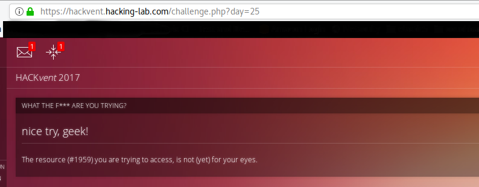
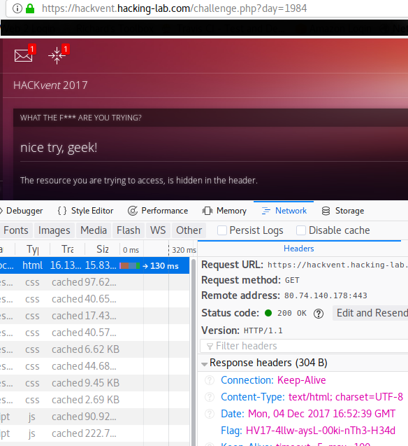
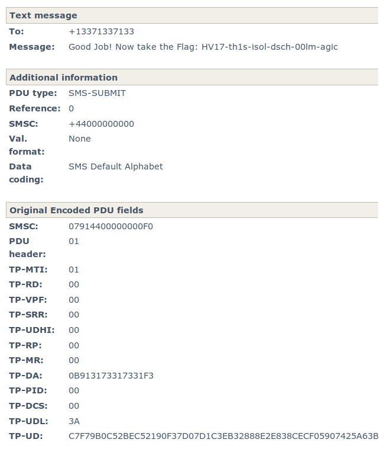
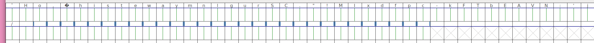
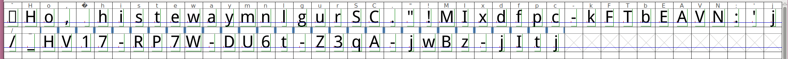

# HackVent 2016

Another edition of Hacking-Lab's annual advent calender CTF. Every day between December 1 and Christmas, a new challenge is released. Solve it on the day of release for maximum points, solve it later (but before the new year) for one point less.

## Overview
```
Title                                     Flag
----------------------------------------  -----------------------------
Hidden: We are people, not machines       HV17-bz7q-zrfD-XnGz-fQos-wr2A
Hidden: 1984                              HV17-4llw-aysL-00ki-nTh3-H34d
Day 01: 5th anniversary                   HV17-5YRS-4evr-IJHy-oXP1-c6Lw
Day 02: Wishlist                          HV17-Th3F-1fth-Pow3-r0f2-is32
Day 03: Strange Logcat Entry              HV17-th1s-isol-dsch-00lm-agic
Day 04: HoHoHo                            HV17-RP7W-DU6t-Z3qA-jwBz-jItj
Day 05: Only one hint                     HV17-7pKs-whyz-o6wF-h4rp-Qlt6
```
---
## Hidden: We are people, not machines
Go to [https://hackvent.hacking-lab.com/robots.txt](https://hackvent.hacking-lab.com/robots.txt) and you'll see ```We are people, not machines```.
Follow this hint and go to [https://hackvent.hacking-lab.com/humans.txt](https://hackvent.hacking-lab.com/humans.txt).
```
All credits go to the following incredibly awesome HUMANS (in alphabetic order):
avarx
DanMcFly
HaRdLoCk
inik
Lukasz
M.
Morpheuz
MuffinX
PS
pyth0n33

HV17-bz7q-zrfD-XnGz-fQos-wr2A
```
---
## Hidden: 1984
While trying a day which doesn't have a challenge I got a strange error message with a ressource #:


Let's try to match #0 which is 1984 and it reveals the flag:



---
## Day 01
### Description
Day 01: 5th anniversary
time to have a look back


### Solution
Thanks to shiltemann for the writeups of the years 2014,2015 and 2016 to get the flags.
[https://github.com/shiltemann/CTF-writeups-public](https://github.com/shiltemann/CTF-writeups-public)

```
Flag 2014: HV24-BAAJ-6ZtK-IJHy-bABB-YoMw
Flag 2015: HV15-Tz9K-4JIJ-EowK-oXP1-NUYL
Flag 2016: HV16-t8Kd-38aY-QxL5-bn4K-c6Lw
```
```
Solution: HV17-5YRS-4evr-IJHy-oXP1-c6Lw
```
---
## Day 02
### Description
Day 02: Wishlist  
The fifth power of two

[Wishlist.txt](./Ressources/Wishlist.txt)

### Solution
```2^5 = 32```

So we can assume that it is base32 encoded. But after the first run, we just got another base32 encoded string.

Let's solve this with python:
```python
import base64

f = open('./Wishlist.txt', 'r')
data = f.read()
while True:
    data = base64.b64decode(data)
    if "HV17" in data:
        print data
        break
```
```
Solution: HV17-Th3F-1fth-Pow3-r0f2-is32
```

---
## Day 03
### Description
Day 03: Strange Logcat Entry
Lost in messages

I found those strange entries in my Android logcat, but I don't know what it's all about... I just want to read my messages!
[logcat.txt](./Ressources/logcat.txt)

### Solution
Inside the logcat entries is one special interessting
```
11-13 20:40:24.044	137	  137  DEBUG: I 07914400000000F001000B913173317331F300003AC7F79B0C52BEC52190F37D07D1C3EB32888E2E838CECF05907425A63B7161D1D9BB7D2F337BB459E8FD12D188CDD6E85CFE931
```

This is a PDU message (SMS). With the help of [https://www.diafaan.com/sms-tutorials/gsm-modem-tutorial/online-sms-pdu-decoder/](https://www.diafaan.com/sms-tutorials/gsm-modem-tutorial/online-sms-pdu-decoder/) I was able to decode the message:



---
## Day 04
### Description
Santa has hidden something for you [Here (Orignial)](./Ressources/HoHoHo_medium.pdf) [Here (Simplified)](./Ressources/HoHoHo.pdf)

### Solution
In the PDF is a custom font embedded. In the simplified version, it is an attachment.
Open the font in Fontforge and you'll see that it doesn't have all availabe chars in it. But it has a lot of unprintable...



After playing a bit with the display options and enabling "Fit to font bounding box" of Fontforge I was able to show their content and voilà


```
Solution: HV17-RP7W-DU6t-Z3qA-jwBz-jItj
```
---
## Day 05
### Description

Here is your flag:
```
0x69355f71
0xc2c8c11c
0xdf45873c
0x9d26aaff
0xb1b827f4
0x97d1acf4
```
and the one and only hint:

0xFE8F9017 XOR 0x13371337

### Solution
```0xFE8F9017 XOR 0x13371337 = 0xedb88320```  
0xedb88320 is a known CRC32 Polynom.
6 CRC32 checksums means 1 checksum per part of the flag. Luckly it is possible to reverse CRC32 checksums up to 5 bytes.

```python
import string
import itertools

def crc_message(msg):
    crc = 0 ^ 0xFFFFFFFF
    for i in msg:
        crc = crc32(ord(i), crc, )
    return crc ^ 0xFFFFFFFF


def crc32(byte, crc):
    crc ^= byte
    for k in range(0, 8):
        if crc & 1:
            crc = (crc >> 1) ^ crc_polynom
        else:
            crc = crc >> 1
    return crc

def crc_with_table(msg, table):
    pass

def brute(target_hash):
    baseChars = string.ascii_letters + string.digits
    for i in itertools.product(baseChars, baseChars, baseChars, baseChars):
        joined = ''.join(i)
        print("Testing %s" % joined)
        if crc_message(joined) == target_hash:
            return joined

def gen_table(polynom):
    table = []
    for i in range(0, 256):
        entry = i
        for j in range(8, 0, -1):
            if entry & 1:
               entry = (entry >> 1) ^ polynom
            else:
                entry >>=1
        table.append(entry)
    
    return table

def patch(wanted):
    w = wanted ^ 0xFFFFFFFF
    table = []
    for i in range(0, len(crc_table)):
        table.append(crc_table[i])

    table.sort()
    message = []
    r = []
    width = 4
    hash = 0xFFFFFFFF
    for p in range(0, width):
        message.append((hash & (256**(p+1)-1)) >> (8 * p))
    for p in range(0, width):
        message.append((w & (256**(p+1)-1)) >> (8 * p))
    for p in range(width - 1, -1, -1):
        o = table[message[p+width]]
        for q in range(0,width):
            v = (o & (256**(q+1)-1)) >> (8 * q)
            message[p+q+1] = message[p+q+1] ^ v
        message[p] = message[p] ^ crc_table.index(o)
    for p in range(0, width):
        r += chr(message[p])
    return r

keys = [
    0x69355f71,
    0xc2c8c11c,
    0xdf45873c,
    0x9d26aaff,
    0xb1b827f4,
    0x97d1acf4
]

crc_polynom = 0xedb88320
crc_table = gen_table(crc_polynom)

for key in keys:
    #print(brute(key))
    print(''.join(patch(key)))
```
```
Solution: HV17-7pKs-whyz-o6wF-h4rp-Qlt6
```
